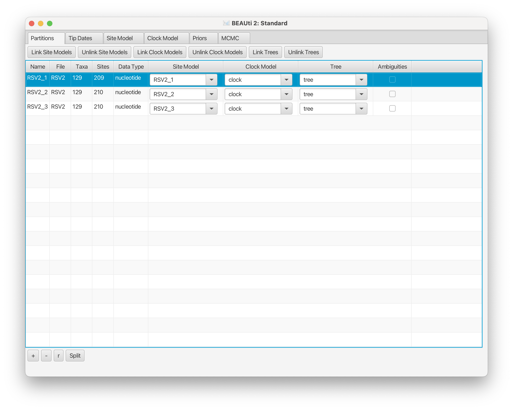
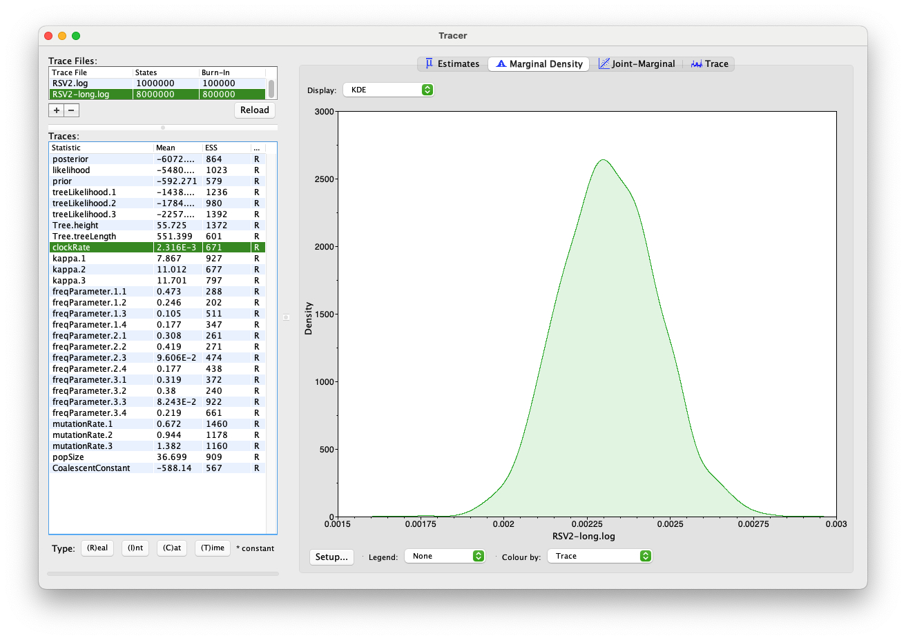
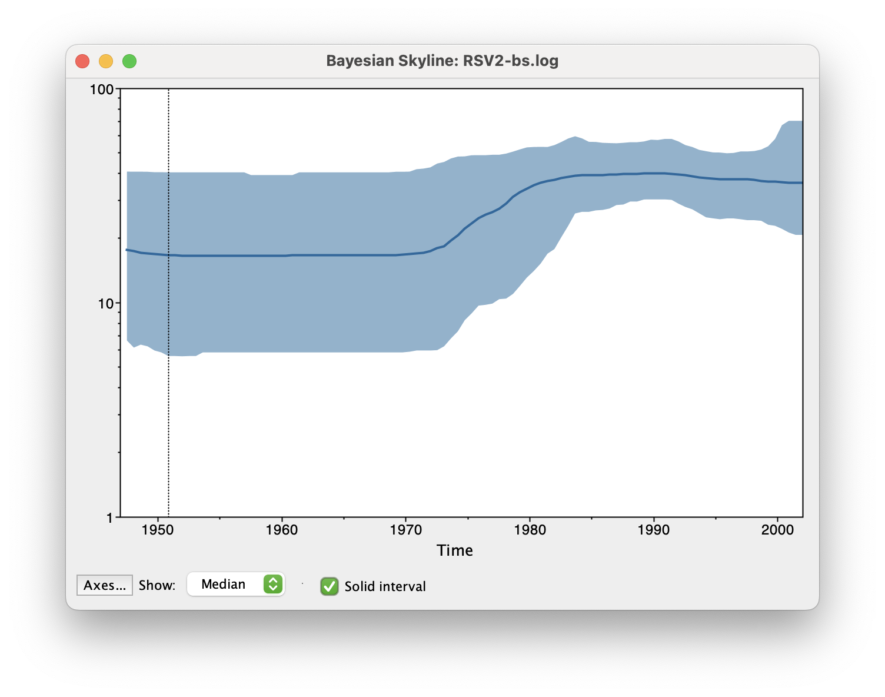

# Time-stamped data

This tutorial estimates the rate of evolution from a set of virus
sequences isolated at different points in time
(heterochronous or time-stamped data). The data consist of 129 sequences from
the G (attachment protein) gene of human respiratory syncytial virus
subgroup A (RSVA). These viral sequences come from various parts of the world
at isolation dates ranging from 1956 to 2002 
(, ). 
RSVA infects the lower respiratory tract and causes symptoms that are
often indistinguishable from the common cold. Nearly all
children are infected by age 3, and a small percentage (<3%) develops
a more serious inflammation of the bronchioles requiring hospitalisation.

The aim of this tutorial is to estimate:

-   the rate of molecular evolution

-   the date of the most recent common ancestor

-   the phylogenetic relationships with measures of statistical support.


BEAST 2 requires [Zulu Java 17](https://www.azul.com/downloads/?version=java-17-lts&package=jdk-fx#zulu).
However, if you download the official BEAST 2 release, it already includes Zulu Java 17. 
No separate installation is needed.

The following software will be used in this tutorial:

-   **BEAST** - this package contains the BEAST program, BEAUti,
    DensiTree, TreeAnnotator and other utility programs. This tutorial
    is written for BEAST v`2.7.x`, which has support for multiple
    partitions. It is available for download from [http://www.beast2.org](http://www.beast2.org).

-   **BEAST [CCD](https://github.com/CompEvol/CCD) package** - this package 
    implements point estimators based on the conditional clade distribution (CCD),
    which allows TreeAnnotator to produce better summary trees than via MCC trees 
    (which is restricted to the sample).
    It offers different parameterizations, such as CCD1, which is based on clade split frequencies, 
    and CCD0, which is based on clade frequencies. It can be installed through Package Manager.

-   **Tracer** - this program is used to explore the output of BEAST
    (and other Bayesian MCMC programs). It graphically and quantitively
    summarises the distributions of continuous parameters and provides
    diagnostic information. At the time of writing, the current version
    is v`1.7.2`. It is available for download from
    [http://beast.community/tracer](http://beast.community/tracer).

-   **FigTree** - this is an application for displaying and printing
    molecular phylogenies, in particular those obtained using BEAST. At
    the time of writing, the current version is v`1.4.4`. It is
    available for download from [http://beast.community/figtree](http://beast.community/figtree).

-   **Beagle** (optional) - this is a high-performance library 
    that can perform the core calculations at the heart of     
    most Bayesian and maximum likelihood phylogenetics packages.
    [https://github.com/beagle-dev/beagle-lib/wiki](https://github.com/beagle-dev/beagle-lib/wiki).


## Data

### The NEXUS alignment

The data is in a file called
[RSV2.nex](https://github.com/CompEvol/beast2/blob/master/examples/nexus/RSV2.nex?raw=true).
This file contains an alignment of 129 sequences from the G gene of RSVA
virus. These sequences are 629 nucleotides long. 
Click the link above and the raw data will be displayed on your web browser. You can then right-click,
"Save Page As", and save the data as `RSV2.nex` in your working directory.

Alternatively, you can find this data in the `examples/nexus` directory in the directory
where BEAST was installed. If you prefer to use BEAUti, 
you can select the menu `File` => `Set working dir` => `BEAST`.
This will make it easier to find example and tutorial files
distributed with `BEAST`, precluding directory navigation.

### Import and split the alignment

There are two options to import this alignment into BEAUti.

1. From the menu, to click `Import Alignment`.

2. Drag and drop the file into the `Partitions` panel. 
If there is a pop-up dialog to ask you `what to add`, 
then you need to select `Import Alignment` from the drop-down list as shown in Figure 1.

<figure>
	
	<figcaption>Figure 1: Add the alignment from drag-and-drop</figcaption>
</figure>
<br>

The gene we have at hand codes for a protein, meaning its sequence can
be seen as a series of triplets, or codons, with each codon being later
translated into an amino acid (remember the central dogma of molecular
biology!). A string of aminoacids then constitutes a protein.

For our purposes, what matters is that we have now known for a while that
different positions in each codon evolve at different relative rates, which has to do
with what we call the "genetic code" (look up "genetic code redundancy" online). 
In knowing this, we can incorporate this difference in evolutionary rates
by splitting the alignment into three partitions, each representing one 
of the three codon positions.

To do this we will click the `Split` button at the bottom of the `Partitions`
panel and then select the `1 + 2 + 3 frame 3` from the drop-down menu (Figure 2).

<figure>
	
	<figcaption>Figure 2: Split the alignment</figcaption>
</figure>
<br>

This specifies that the first full codon starts at the third nucleotide in the
alignment (it just so happens that our gene sequence starts at the third position
in the sequence), and creates three rows in the partitions panel.

### Linking or unlinking models

For the reasons mentioned above, we want to allow each partition to have its own
substitution model.
This will make it possible for each codon position to have a different relative rates.
But we want to still have all codon positions (i) evolving along the same phylogenetic
tree, and (ii) keeping their evolutionary rates proportionally the same along that tree.

In order to achieve this, you will have to link (i) the tree and (ii) clock models (these
deal with how rates vary along the tree) across the three partitions, and name them `tree`
and `clock`, respectively.
This requires selecting all three partitions first, and clicking the buttons `Link Clock Models`
and `Link Trees`.
The partition panel should now look something like this:

<figure>
	
	<figcaption>Figure 3: A screenshot of the Partitions tab in BEAUti</figcaption>
</figure>
<br>

### Tip dates 

By default, all the taxa are assumed to have a date of zero (i.e., the
sequences are assumed to be sampled at the same time). In our case, the
RSVA sequences have been sampled at various dates going back to the
1950s. The actual year of sampling is given in the name of each taxon,
and we could simply edit the value in the `Date` column of the table to
reflect these.

Knowing the absolute times of sampling and having samples taken over time
-- rather than all samples having been collected only at the present moment -- 
is crucial because otherwise we can't tell the rate `r` and time `t` apart,
where both contribute to the accumulated evolutionary change, `D = r * t`.
We could obtain any value of `D` as the result of
(`1/2r * 2t`) or (`2r * 1/2t`), etc. Can you see how `r` and `t` will be
conflated? We thus need to have one or more samples taken at known absolute
`t` values to be able to disentangle `r` and `t`. This is called "calibrating"
the tree.

Back to our data, when taxa names contain the calibration information, as
is our case, then a convenient way to specify the dates of the sequences
in to let BEAUti figure it out.
You can do that by clicking the checkbox `Use tip dates`, and then clicking
the `Auto-configure` button at the top right of the `Tip Dates` panel.
This will make a dialog box appear.

<figure>
	
	<figcaption>Figure 4: Guess dates dialog</figcaption>
</figure>
<br>

Select the option to `use everything`, choose `after last` from the
drop-down box and type `s` into the corresponding text box. This will
extract the trailing numbers from the taxon names after the last lower-case letter
`s`, which are interpreted as the year (since 1900 in our case) that
the sample was isolated.
You may have noticed these dates are specified as `Since some time in the past`:
this is known as __forward__ time in a phylodynamic analysis.

The dates panel should now look something like this:

<figure>
	
	<figcaption>Figure 5: Dates panel</figcaption>
</figure>
<br>

Thanks to calibration, the node height of the sampled phylogenetic tree
will be scaled to some unit of absolute time (here the unit is `year`),
which makes our phylogenetic trees be what we call "time trees".
Tips having a zero node height will be the latest (i.e., youngest) samples.
The root height of this time tree represents the time to the most recent
common ancestor (tMRCA) of all samples.
To make sure that you selectd the correct option, you can simply look at the
`Height` column. The heights of earlier samples should always be larger than
those of later (recent) samples.


## Model

### Setting the substitution model 

We will use the HKY model and estimate base frequencies for all three partitions. 
To do this, first switch to the `Site Model` panel, 
and then choose `HKY` from the `Subst Model` drop-boxes,
and `Estimated` from the `Frequencies` drop-boxes. 
Also remember to check the `estimate` checkbox for the `Substitution Rate`.
After three relative rates are all set to estimate, 
it will eventually trigger to check the `Fix mean substitution rate` box.

<figure>
	
	<figcaption>Figure 6: Site model</figcaption>
</figure>
<br>

Here, we can use `Clone` function to replicate the configuration. 
Hold `shift` key to select all site models on the left side, 
and click `OK` to clone the settings from a selected site model (Figure 7). 
Go through each site model, as you can see, their
configurations are same now.

<figure>
	
	<figcaption>Figure 7: Clone configuration from one site model to others.</figcaption>
</figure>
<br>


The main objective here is to set up the analysis to estimate the relative rates
of codons, which are relative to a general rate defined in the molecular clock model.


### Molecular clock model

We are going to use a strict clock model in our analyses.
This is the simplest clock model that one can use, and it assumes that relative rates
remain constant throughout the whole tree.
The strict clock model is also the default clock model in BEAUti, so no changes are
necessary in the clock model panel.
If you want, you can specify a starting value for the `clockRate` parameter. 

### Priors 

Priors are part of a Bayesian model, and describe our beliefs or prior inferences
about the model parameters. Each parameter (including the tree!) is assigned a prior
distribution, and this must be done *before* looking at the data.

To set up the priors, select the `Priors` tab. 
We are going to choose a simple tree prior for this analysis, 
so select `Coalescent Constant Population`. 

For our molecular clock model, we will set the prior on the `clockRate` parameter
to a log-normal distribution with mean of -5, and standard deviation of 1.25
(`M=-5` and `S=1.25`).
The plot of this prior distribution and its quantiles can be visualised on the right
side.

<figure>
	<a name="fig:BEAUti\_priors"></a>
	
	<figcaption>Figure 8: Priors</figcaption>
</figure>
<br>

The further reading about priors can be seen from the tutorial
[Prior selection](https://taming-the-beast.org/tutorials/Prior-selection/)


## Setting the MCMC options

For this dataset, let’s initially set the chain length to `1000000` as this will
run reasonably quickly on most modern computers. 
Set the sampling frequencies for the screen logging to `10000`,
the trace log file to `500` and the trees file to `500`.
(So, how many samples are we expecting to have in the trace log file?)

Also, change the log file name to `RSV2.log` and tree log file name to `RSV2.trees`.
If you keep the default tree log file name, 
`$(tree)` will be replaced by the name defined at the `Tree` column in the `Partitions`
panel. 

<figure>
	
	<figcaption>Figure 9: MCMC options</figcaption>
</figure>
<br>

Then, select menu `View => Show Operators panel`, change all three `freqParameter.s` weight to 0.1 for faster mixing.
<figure>
	
	<figcaption>Figure 10: MCMC operator options</figcaption>
</figure>
<br>

## Running BEAST 

Save the BEAST `.xml` specification file (e.g., `RSV2.xml`).

<figure>
	
	<figcaption>Figure 11: A screenshot of BEAST.</figcaption>
</figure>
<br>

Now run BEAST and when it asks for an input file, provide your newly
created `.xml` file as input.
We recommend you to use BEAGLE library, if it is installed on your
machine.
BEAST will then run until it has finished reporting information to the
screen. The actual results files are saved to disk in the same location
as your input file. The output to the screen will look something like this:

```
                        BEAST v2.7.8, 2002-2025
             Bayesian Evolutionary Analysis Sampling Trees
                       Designed and developed by
 Remco Bouckaert, Alexei J. Drummond, Andrew Rambaut & Marc A. Suchard
                                    
                   Centre for Computational Evolution
                         University of Auckland
                       r.bouckaert@auckland.ac.nz
                        alexei@cs.auckland.ac.nz
                                    
                   Institute of Evolutionary Biology
                        University of Edinburgh
                           a.rambaut@ed.ac.uk
                                    
                    David Geffen School of Medicine
                 University of California, Los Angeles
                           msuchard@ucla.edu
                                    
                      Downloads, Help & Resources:
                           http://beast2.org/
                                    
  Source code distributed under the GNU Lesser General Public License:
                   http://github.com/CompEvol/beast2
                                    
                           BEAST developers:
   Alex Alekseyenko, Trevor Bedford, Erik Bloomquist, Joseph Heled, 
 Sebastian Hoehna, Denise Kuehnert, Philippe Lemey, Wai Lok Sibon Li, 
Gerton Lunter, Sidney Markowitz, Vladimir Minin, Michael Defoin Platel, 
          Oliver Pybus, Tim Vaughan, Chieh-Hsi Wu, Walter Xie
                                    
                               Thanks to:
          Roald Forsberg, Beth Shapiro and Korbinian Strimmer
    ...
    
    ...
        990000     -6074.2887     -5479.0850      -595.2037 40s/Msamples
        1000000     -6061.4821     -5480.6611      -580.8210 40s/Msamples

Operator                                                                                             Tuning    #accept    #reject      Pr(m)  Pr(acc|m)
AdaptableOperatorSampler(StrictClockRateScaler.c:clock)                                                   -       3409      14691    0.01797    0.18834 
AdaptableOperatorSampler(strictClockUpDownOperator.c:clock)                                               -         72      17875    0.01797    0.00401 
AdaptableOperatorSampler(KappaScaler.s:RSV2_1)                                                            -        107        504    0.00060    0.17512 
AdaptableOperatorSampler(FrequenciesExchanger.s:RSV2_1)                                                   -        247        983    0.00120    0.20081 
beast.base.inference.operator.kernel.BactrianDeltaExchangeOperator(FixMeanMutationRatesOperator)    0.20734       6555      17595    0.02397    0.27143 
AdaptableOperatorSampler(FrequenciesExchanger.s:RSV2_2)                                                   -        257        928    0.00120    0.21688 
AdaptableOperatorSampler(KappaScaler.s:RSV2_2)                                                            -        158        434    0.00060    0.26689 
AdaptableOperatorSampler(FrequenciesExchanger.s:RSV2_3)                                                   -        323        858    0.00120    0.27350 
AdaptableOperatorSampler(KappaScaler.s:RSV2_3)                                                            -        101        485    0.00060    0.17235 
EpochFlexOperator(CoalescentConstantBICEPSEpochTop.t:tree)                                          0.03374       4705      19543    0.02397    0.19404 
EpochFlexOperator(CoalescentConstantBICEPSEpochAll.t:tree)                                          0.03538       4451      19420    0.02397    0.18646 
TreeStretchOperator(CoalescentConstantBICEPSTreeFlex.t:tree)                                        0.02322       6056      18136    0.02397    0.25033 
kernel.BactrianScaleOperator(CoalescentConstantTreeRootScaler.t:tree)                               0.07369       6918      28840    0.03595    0.19347 
kernel.BactrianNodeOperator(CoalescentConstantUniformOperator.t:tree)                               2.28981     122186     237157    0.35950    0.34003 
kernel.BactrianSubtreeSlide(CoalescentConstantSubtreeSlide.t:tree)                                  1.75417      27766     151901    0.17975    0.15454 
Exchange(CoalescentConstantNarrow.t:tree)                                                                 -      44685     134901    0.17975    0.24882 
Exchange(CoalescentConstantWide.t:tree)                                                                   -         81      35977    0.03595    0.00225 
WilsonBalding(CoalescentConstantWilsonBalding.t:tree)                                                     -        240      35551    0.03595    0.00671 
kernel.BactrianScaleOperator(PopSizeScaler.t:tree)                                                  0.21351       9519      26386    0.03595    0.26512 

     Tuning: The value of the operator's tuning parameter, or '-' if the operator can't be optimized.
    #accept: The total number of times a proposal by this operator has been accepted.
    #reject: The total number of times a proposal by this operator has been rejected.
      Pr(m): The probability this operator is chosen in a step of the MCMC (i.e. the normalized weight).
  Pr(acc|m): The acceptance probability (#accept as a fraction of the total proposals for this operator).


Total calculation time: 41.908 seconds
End likelihood: -6061.482176048203
```

## Analysing the BEAST output 

Drag and drop the BEAST log file `RSV2.log` to the left panel of the software
`Tracer`.
Note that the effective sample sizes (ESSs) for many of the logged
quantities are small (ESSs less than 100 will be highlighted in red by
Tracer). This is not good. A low ESS means that the trace contains a lot
of correlated samples and thus may not represent the posterior
distribution well. In the bottom right of the window is a frequency plot
of the samples which is expected given the low ESSs is extremely rough.

If we select the tab on the right-hand-side labelled `Trace` we can view
the raw trace, that is, the sampled values against the step in the MCMC
chain.

<figure>
	
	<figcaption>Figure 12: A screenshot of Tracer for a short chain length.</figcaption>
</figure>
<br>

Here you can see how the samples are correlated. There are 2000 samples
in the trace (we ran the MCMC for steps sampling every 500) but adjacent
samples often tend to have similar values. 
The ESS for the `clockRate` is about `89`, after removing the first 10% of 
the samples as burn-in.
So we are only getting 1 independent sample to every `20 ~ 1800/89` actual samples). 
With a short run such as this one, it may also be the case that 
the default burn-in (10%) of the chain length is inadequate. 
Not excluding enough of the start of the chain as burn-in will render estimates of ESS unreliable.

The simple response to this situation is that we need to run the chain for longer. 
Given the lowest ESS (e.g., for the constant coalescent parameter) is `13`, 
it would suggest that we have to run a much longer chain (e.g. 16 times of the current length). 
But this is a simple dataset, the length of 8 million would generate samples 
providing the reasonable ESSs that are `>200`. 

So let's go back to BEAUti, set the chain length to 8000000 and log every 4000 
in the `MCMC` panel. We will also rename the log file to `RSV2-long.log`
and tree log file name to `RSV2-long.trees`. 
Then we can create a new BEAST `.xml` file `RSV2-long.xml` with a longer chain length. 
Now run BEAST again and load the new log file into Tracer 
(you can leave the old one loaded for comparison).
Please note BEAST does not support multiple instances from GUI, 
so you have to close the previous run before you can start a new one.

Click on the `Trace` tab and look at the raw trace plot.

<figure>
	
	<figcaption>Figure 13: A screenshot of Tracer for a long chain length.</figcaption>
</figure>
<br>

We have chosen options that produce the same number of samples 
but with a larger ESS. 
There is still auto-correlation between the samples but
`>200` effectively independent samples will now provide a better
estimate of the posterior distribution. There are no obvious trends in
the plot which would suggest that the MCMC has not yet converged, and
there are no significant long range fluctuations in the trace which
would suggest poor mixing.

As we are satisfied with the mixing, we can now move on to one of the
parameters of interest: the molecular clock rate. Select `clockRate` in the
left-hand table. This is the average clock rate across all sites
in the alignment. Now choose the density plot by selecting the tab
labeled `Marginal Density`. This shows a plot of the marginal
posterior probability density of this parameter. You should see a plot
similar to this:

<figure>
	<a name="fig:Tracer\_density"></a>
	
	<figcaption>Figure 14: marginal density in tracer</figcaption>
</figure>
<br>

As you can see, the posterior probability density is roughly bell-shaped.
There is some sampling noise that would be reduced if we ran the chain
for longer or sampled more often, but we already have a good estimate of
the mean and HPD interval. You can overlay the density plots of multiple
traces in order to compare them (it is up to the user to determine
whether they are comparable on the same axis or not). Select the
relative rates for all three codon positions in the table
to the left (labelled `mutationRate.1`, `mutationRate.2` and
`mutationRate.3`). You will now see the posterior probability densities
for the relative rate at all three codon positions overlaid:

<figure>
	
	<figcaption>Figure 15: The posterior probability densities for the relative rates</figcaption>
</figure>
<br>

## Summarising trees 

To summarise the trees logged during MCMC, 
we will use the [CCD methods](https://doi.org/10.1101/2024.02.20.581316) 
implemented in the program TreeAnnotator to create the maximum a posteriori (MAP) tree. 
The implementation of the conditional clade distribution (CCD) offers different parameterizations, 
such as CCD1, which is based on clade split frequencies, and CCD0, which is based on clade frequencies. 
The MAP tree topology represents the tree topology with the highest posterior probability, 
averaged over all branch lengths and substitution parameter values.

You need to install [CCD package](https://github.com/CompEvol/CCD) to make the options 
available in TreeAnnotator. 

Please follow these steps after launching TreeAnnotator:

1. Set 10% as the burn-in percentage;
2. Select "MAP (CCD0)" as the "Target tree type";
3. For "Node heights", choose "Common Ancestor heights";
4. Load the tree log file that BEAST 2 generated (it will end in ".trees" by default) 
   as "Input Tree File". For this tutorial, the tree log file is called "RSV2-long.trees".
   If you select it from the file chooser, the parent path will automatically fill in and 
   "YOUR_PATH" in the screenshot will be that parent path.
5. Finally, for "Output File", copy and paste the input file path but replace 
   the file name "RSV2-long.trees" with "RSV2-ccd0.tree". 
   This will create the file containing the resulting MAP tree.

The image below shows a screenshot of TreeAnnotator with the necessary settings to 
create the summary tree. "YOUR_PATH" will be replaced to the corresponding path.

<figure>
	
	<figcaption>Figure 16: TreeAnnotator for creating a summary tree from a posterior tree set.</figcaption>
</figure>
<br>

More details can be found on [summarising trees](https://www.beast2.org/summarizing-posterior-trees/)

## Visualising trees

Summary trees can be viewed by `FigTree` (a program separate from BEAST) 
and `DensiTree` (distributed with BEAST). 
FigTree can only see one tree at a time, 
so we normally use it to visualise the summary tree.

Let us open the summary tree in `FigTree`. First, open the `Trees` tab on the left panel,
and tick the checkbox `Order nodes`.
Tick the checkbox of the `Node Bars` tab and open it. 
By selecting `height_95%_HPD`, you will be able to display the 95% HPD-intervals on
internal node ages (as bars) over each internal node.
Then tick the `Node labels` checkbox, and switch the `Display` 
between `height` (mean) and `height_95%_HPD`.

In order to interpret the estimated node heights, note that the latest sample in our data
set is from 2002. 
We can thus convert our node heights to years by subtracting their heights from 2002.

<figure>
	
	<figcaption>Figure 17: The summary tree for the G gene of 129 RSVA-2 viral samples.</figcaption>
</figure>
<br>

Now load all your posterior trees to `DensiTree`.
Click the `show` tab and tick the `Root Canal` checkbox.
The "root canal tree", drawn in thick blue lines,
represents the summary tree.
Open the `Grid` tab, choose `Short grid`, pick `Reverse` for the
scale axis, and set the `Origin` to 2002. 
Please be aware that the origin here means the date of the youngest tips.

Before we can show the 95% HPD interval on the node heights, 
we need to click the `Central` button on the top right corner under the `type` tab.   
Then open the `Clades` tab, set the `Smallest` text filed to 0.5, 
to select only the clades with over 50% support.
Then, tick the `Show clades`, and switch `draw` option from `Support` to `95%HPD`. 
The error bars representing the 95% HPD interval of internal nodes will now be displayed.
If you want to show a particular node, such as the root, 
you can tick the `Select only` checkbox, and select it from the panel. 

<figure>
	
	<figcaption>Figure 18: The posterior tree set visualised in DensiTree.</figcaption>
</figure>
<br>


## Questions 

>
> 1. What are the absolute mutation rates for the three codon positions?
>
> 2. In what year did the most recent common ancestor of all RSVA samples live?
What is the 95% HPD?


## Bonus section: Bayesian Skyline plot 

We can reconstruct the population history using the Bayesian Skyline
plot. In order to do so, load the `.xml` file into BEAUti using the menu `File` => `Load`. 
Select the `Priors` panel and change the tree prior from `Coalescent Constant Population`
to `Coalescent Bayesian Skyline`.
Note that an extra item is added to the priors called `Markov chained population sizes`
which is a prior that ensures dependence between population sizes.

<figure>
	
	<figcaption>Figure 19: Priors</figcaption>
</figure>
<br>

By default, the number of groups used in the skyline analysis is set to
`5`. To change this, select menu `View` => `Show Initialization panel`, 
and then a list of parameters is shown in the `Initialization` panel. 
Select `bPopSizes.t:tree`, change the dimension to 3 and upper to `100000`. 
Likewise, select `bGroupSizes.t:tree` and change its dimension to `3`. 
The dimensions of the two parameters should be the same. More groups mean more population changes can be detected, 
but it also means more parameters need to be estimated, and that the MCMC chain must
run longer. The extended Bayesian skyline plot automatically detects the
number of changes, so it could be used as an alternative tree prior.

<figure>
	
	<figcaption>Figure 20: Initialization panel</figcaption>
</figure>
<br>

This analysis takes longer to converge, so we will change the MCMC
chain length to 10 million, and the log intervals for the trace log and
tree log to 10 thousand. Then, save the file and run BEAST. You can also 
download the log (`RSV2-bs.log`) and tree (`RSV2-bs.trees`) files from 
the `precooked-runs` directory.

To plot the population history, load the log file in tracer and select
the menu `Analysis` => `Bayesian Skyline Reconstruction`.

<figure>
	
	<figcaption>Figure 21: Bayesian Skyline Reconstruction in Tracer</figcaption>
</figure>
<br>

A dialog is shown where you can specify the tree file associated with
the log file. Set `Maximum time is the root height's` to `Median`. Also, since the youngest sample is from 2002, 
change the entry for age of youngest tip to 2002.

<figure>
	
	<figcaption>Figure 22: Bayesian Skyline Reconstruction dialog in Tracer</figcaption>
</figure>
<br>

After some calculation, a graph appears showing a population history where
the median and 95% HPD intervals are plotted. After selecting the 
`solid interval` checkbox, the graph should look something like this.

<figure>
	
	<figcaption>Figure 23: Bayesian Skyline Reconstruction</figcaption>
</figure>
<br>

## Questions 

>
>1.  By what amount did the effective population size of RSVA grow from
>    1970 to 2002 according to the BSP?
>
>2.  What are the underlying assumptions of the BSP? Are they violated by
>    this data set?
>

## Exercise

Change the Bayesian skyline prior to extended Bayesian skyline plot
(EBSP) prior and run until convergence. EBSP produces an extra log file,
called `EBSP.$(seed).log` where `$(seed)` is replaced by the seed you used
to run BEAST. A plot can be created by running the `EBSPAnalyser` utility 
from `AppLauncher`, and loading the output file in a spreadsheet.

> How many groups are indicated by the EBSP analysis? This is much lower
> than for BSP. How does this affect the population history plots?

# Useful Links

- [Bayesian Evolutionary Analysis with BEAST 2](http://www.beast2.org/book.html) 
- BEAST 2 website and documentation: [http://www.beast2.org/](http://www.beast2.org/)
- Join the BEAST user discussion: [http://groups.google.com/group/beast-users](http://groups.google.com/group/beast-users) 

# Relevant References


